# Lineage Mapper User Guide

## Table of Contents
<!-- TOC depth:6 withLinks:1 updateOnSave:1 orderedList:0 -->

- [Lineage Mapper User Guide](#lineage-mapper-user-guide)
	- [Table of Contents](#table-of-contents)
	- [Getting Started](#getting-started)
		- [Installing Fiji](#installing-fiji)
		- [Lineage Mapper Plugin Installation](#lineage-mapper-plugin-installation)
		- [Launching the Plugin](#launching-the-plugin)
		- [Loading an Image Sequence into Fiji](#loading-an-image-sequence-into-fiji)
	- [Lineage Mapper GUI](#lineage-mapper-gui)
		- [Input Parameters](#input-parameters)
		- [Output Parameters](#output-parameters)
		- [Advanced Parameters](#advanced-parameters)
- [FAQ](#faq)
<!-- /TOC -->

## Getting Started
This section describes how to install the *Lineage Mapper* plugin. Section [Installing Fiji](#installing-fiji) describes how to get Fiji. Section [Lineage Mapper Plugin Installation](#lineage-mapper-plugin-installation) describes how to add the plugin into Fiji. General help relating to Fiji and ImageJ can be found online.

1.  ImageJ <http://rsbweb.nih.main.java.gov/ij/index.html>
2.  Fiji <http://fiji.sc/Fiji>

### Installing Fiji

To download Fiji go to <http://fiji.sc/Downloads> and follow their installation instructions for your platform.

### Lineage Mapper Plugin Installation

Use the following steps to add the Lineage Mapper site to the list of your Fiji update sites in order to add the plugin into Fiji.

1.  Open Fiji
2.  Menu item: *Help* >> *Update...* (If any updates are available, apply changes first and restart Fiji and redo steps 1 and 2)

    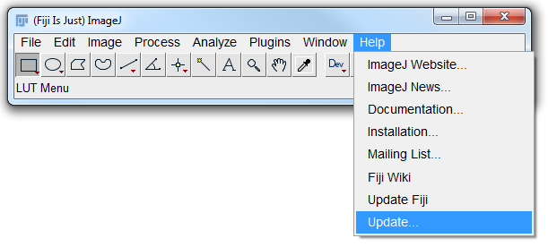

3.  Click: Manage update sites

    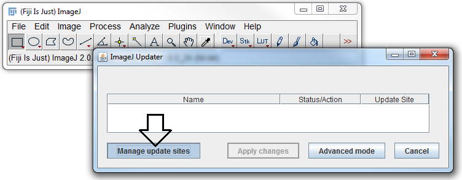

4.  Click: Add (This will create a new row)

    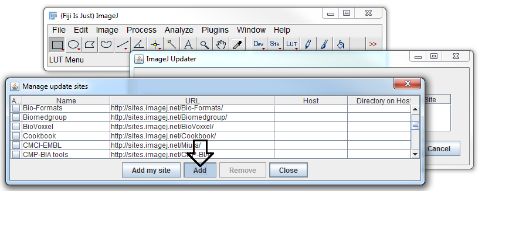

5.  Select name column in new row and type: *Lineage Mapper*
6.  Select URL column in new row and type:
    **TODO**

    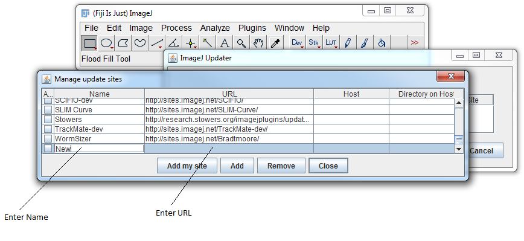

7.  Press Enter and *Apply changes* to install

8.  Relaunch Fiji to complete installation

### Launching the Plugin

This section assumes you have already installed the plugin using the steps described in section [Lineage Mapper Plugin Installation](#lineage-mapper-plugin-installation).

To launch the *Lineage Mapper* plugin:

1.  Open Fiji

2.  Menu item: *Plugins* >> *Tracking* >> *Lineage Mapper*

    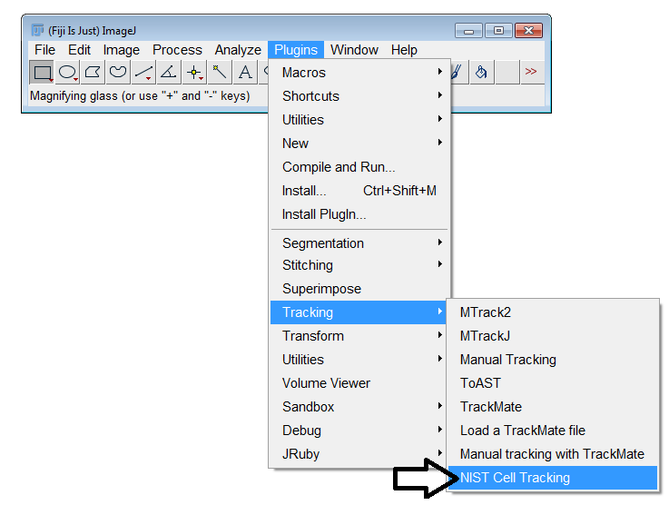

    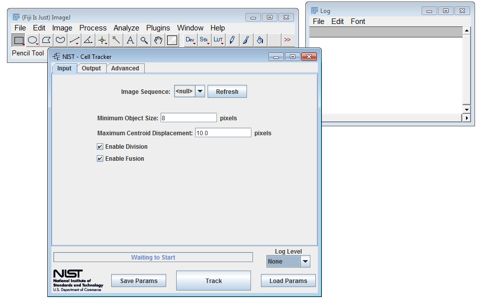

### Loading an Image Sequence into Fiji

The Cell Tracker expects a segmented image sequence (an Image Stack within ImageJ <http://rsbweb.nih.main.java.gov/ij/docs/guide/146-8.html>). Segmented images are images where the regions of interest are labeled from 1 to maximum number of objects per image. The object numbering does not need to reflect any organization of the objects. The labeled regions of interest in the segmented images all consist of pixels that have the value of the object label. For example, every pixel in the object labeled 5 has a pixel value of 5. Background pixels have the value 0. The image sequence can be loaded into Fiji in any number of ways. For a full listing see ImageJ <http://rsbweb.nih.main.java.gov/ij/docs/guide/146-26.html> and Fiji <http://fiji.sc/Importing_Image_Files> documentation. Methods of loading an image sequence into Fiji:
1.  Drag and Drop a folder containing images onto the Fiji Window.
2.  Menu item: *File* >> *Import* >> *Image Sequence*

    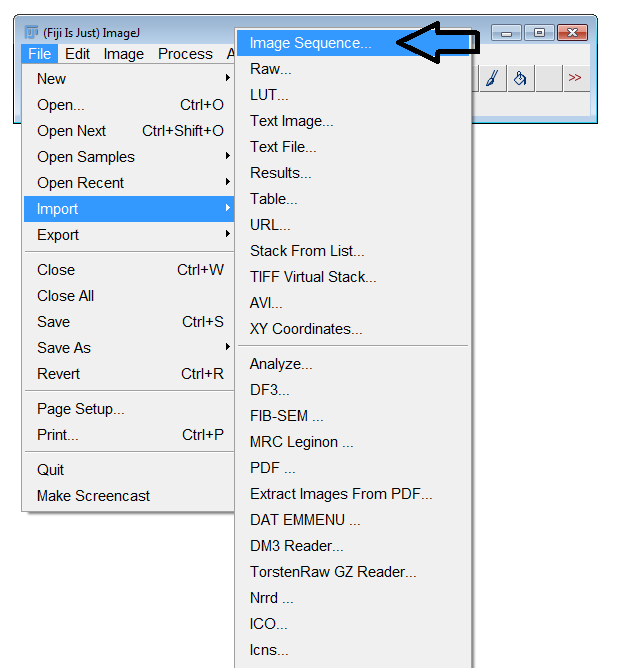

## Lineage Mapper GUI

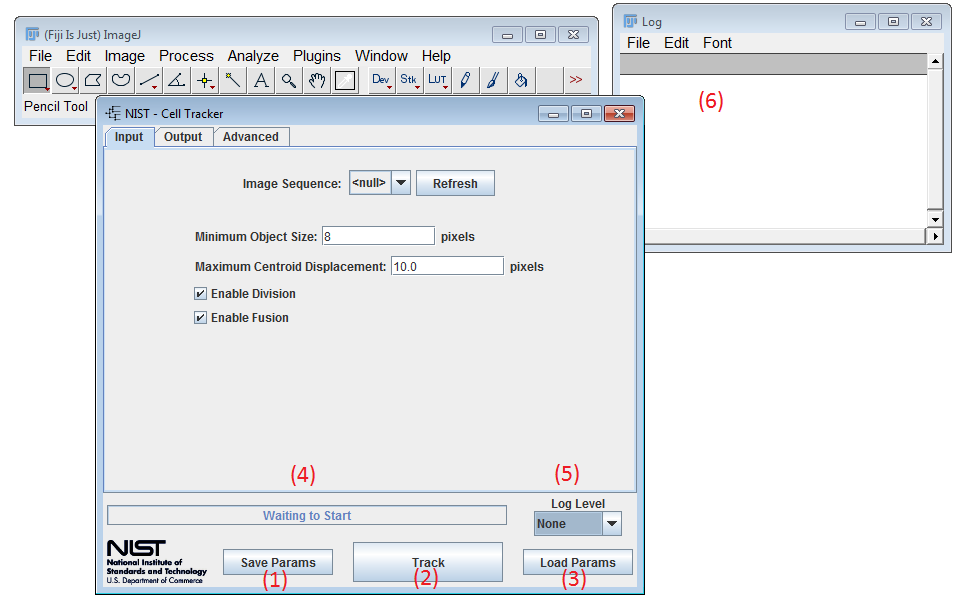

* **(1) Save Params** - Saves the current parameters to a file. When clicked, a save dialog will appear.

* **(2) Track** - Launches the tracking. Prior to launching all parameters are validated. Any parameter that does not pass the argument checks will be highlighted. *Lineage Mapper* will query for confirmation before overwriting any files on disk. Additionally, any error messages will appear in the log file (see **(6)**)

* **(3) Load Params** - Loads parameters from a file. When clicked a load dialog will appear. Users can load the file that was saved using **Save Params**.

* **(4) Status Bar** - Status bar showing the current status of the tracking.

* **(5) Log Level** - Log Level control. Specifies what level of detail log messages are printed to **(6)**. By default no logging is displayed.

* **(6) Log Window** - The log window is a text area that contains useful information after you click the *Track* button. Any errors will be appended to the log window.

### Input Parameters

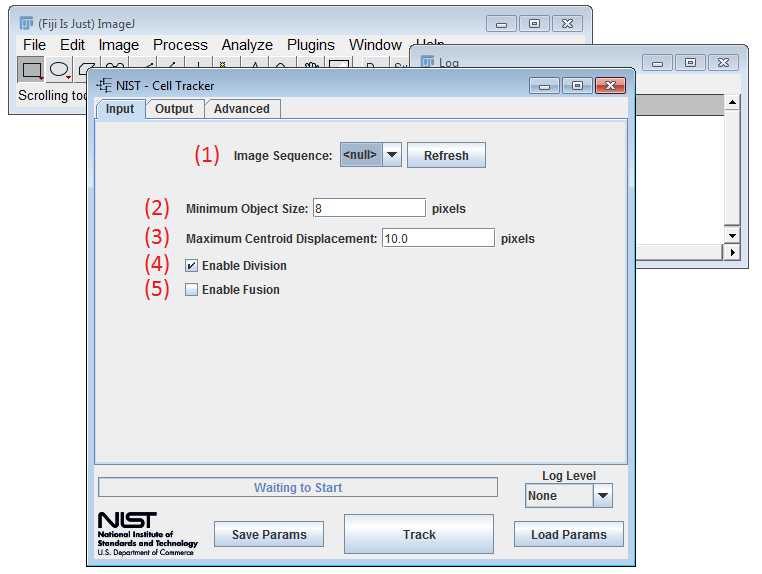

* **(1) Image Sequence** - Specifies which of the image sequences open in Fiji is tracked. The drop down will show “null” if there are no valid image sequences open in Fiji. The Refresh button will update this list. If an image sequence does not appear on the list it is not a valid image sequence for tracking.

* **(2) Minimum Object Size** - The minimum size a labeled foreground object must be in order to be recognized as a cell. Objects smaller than this threshold will be deleted if they were created by splitting the group of cellular area into single cell segments. This parameter is only used when a fusion cases is detected and the cells are cut apart. Otherwise no minimum object size will be enforced on the input labeled masks.

* **(3) Maximum Centroid Displacement** - The maximum centroid distance (in pixels) is used to consider which cells could possibly be tracked together. The radius from a cell centroid to the max centroid distance represents the area of a possible cell migration. For example, the red cell represents the current frame, whereas the blue cells represent the next frame. The Cell Tracker would consider the upper blue cell as a possible tracking option to the red cell and the lower blue cell would be ignored.

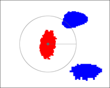

* **(4) Enable Division** - If cell division is enabled, the daughters cells of a mitotic event will be assigned new cell labels, different from their mother cell label. If disabled, the daughters will keep the same label as the mother cell and no mitotic event will be considered. This functionality is helpful when dealing with particle tracking or colony tracking.

* **(5) Enable Fusion** - If cell fusion is enabled, the cell tracker will assign a new unique global ID number to the fused region and will consider all the cells from the previous frame as dead. If disabled, the cell tracker will separate the cellular area in the current frame into a group of single cells by relying on the previous frames information.

### Output Parameters

Once the tracker has successfully completed a tracking session the tracking data collected during the session will be available here.

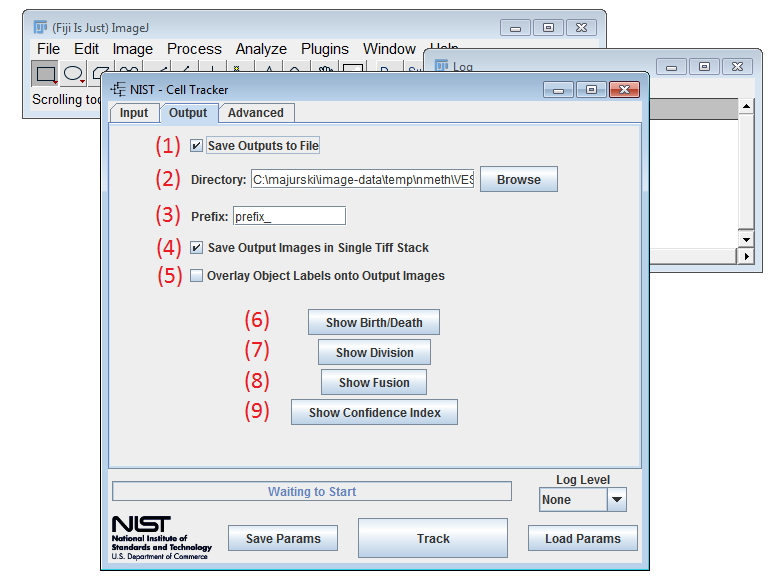

* **(1) Save Outputs to Disk** - Checkbox controls whether outputs from the cell tracker are written to disk, or just displayed using Fiji.

* **(2) Directory** - Specify the output directory where the tracked images and metadata files are saved. This is only enabled and valid if **(1)** is enabled.
Metadata files are saved in the format:
  - *prefix*\_ birth\_death.csv
  - *prefix*\_fusion.csv
  - *prefix*\_division.csv
  - *prefix*\_confidence\_index.csv

*prefix*  - the prefix prepended to output files.

* **(3) Prefix** - The prefix prepended to the output file common names. Files that will be overwritten throw a warning and get confirmation before being overwritten. To remove the warning change the **Prefix** to a unique value.

* **(4) Save Output Images in Single Tiff Stack** - Toggles whether the output tracked images are saved into a single Tiff file as a time sequence, or into individual Tiff files with time point numbering appended to **(3)**. If this is disabled, one Tiff file per time point in the input image sequence will be generated and saved into directory specified in **(2)**. Otherwise a single Tiff file “*prefix*.tif” will be generated.

* **(5) Overlay Object Labels** - If selected, the output tracked images displayed in Fiji will have ROI labels superimposed over each cell object displaying that objects global ID. These labels are non destructive as they do not modify the underlying image; they are simply displayed over top of the image by Fiji.

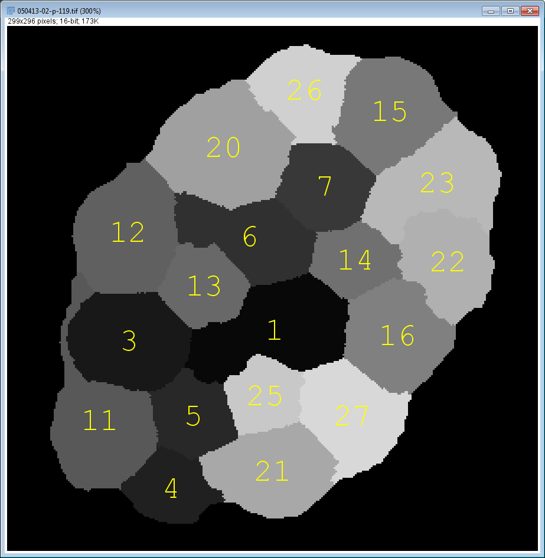

* **(6) Show Birth/Death** - Opens the tracked object birth and death data and displays it in a table. The Birth and Death is a table with three columns and *n* rows where *n* is the total number of cells globally labeled throughout the experiment. The first column is the global cell ID number. The second column (Birth) is the frame index where the cell first appeared in the Field of View and the third column (Death) is the frame index where the cell last appeared in the Field of View.

* **(7) Show Division** - Opens the tracked object division data and displays it in a table. This is only valid if division was enabled. Division is a table with four columns and *n* rows where *n* is the total number of cells globally labeled throughout the experiment. The first column is the time point (frame number) where the division occurred. The second column is global cell ID number of the mother cell. The third column is the global cell ID number of the one of the daughter cells and the fourth column is the global cell ID number of the other daughter cell. The Cell Tracker considers mitosis between a mother cell and its two daughter cells.

* **(8) Show Fusion** - Opens the tracked object fusion data and displays it in a table. This is only valid if fusion was enabled. Fusion is a table of (*m+2*) columns where *m* is the maximum number of cells that fused together at frame *t* to form one object at frame *t+1*. There are *n* rows where *n* is the total number of cells globally labeled throughout the experiment. The first column is the time point (frame number) where the fusion occurred. The second column is the global cell ID number of the fused cell at time point *t+1*. The last *m* columns contain the global ID numbers of the cells that fused together in time point *t* to create the fused cell at time point *t+1*.

* **(9) Show Confidence Index** - Opens the tracked object confidence index data and displays it in a table. The confidence index is a table of two columns and *n* rows where *n* is the total number of cells globally labeled throughout the experiment. The first column is the global cell ID number and the second column is the confidence index of that cell. The table is sorted in a descending order with respect to the confidence index. Higher confidence index value corresponds to more trust in the entire track of a cell during its lifetime.

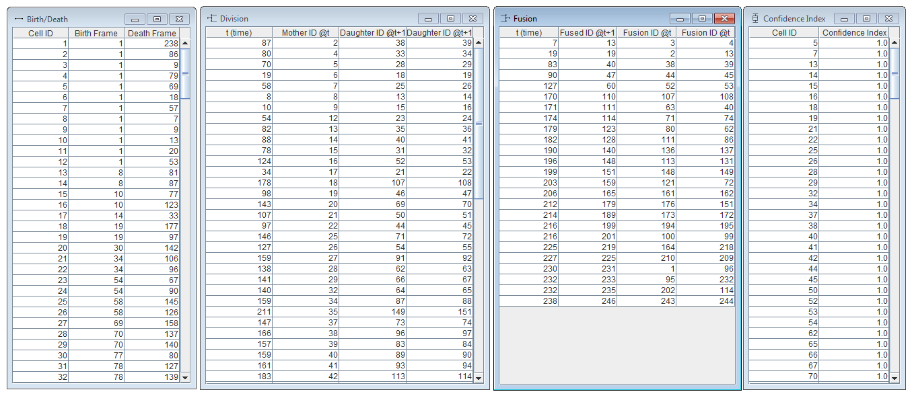

### Advanced Parameters

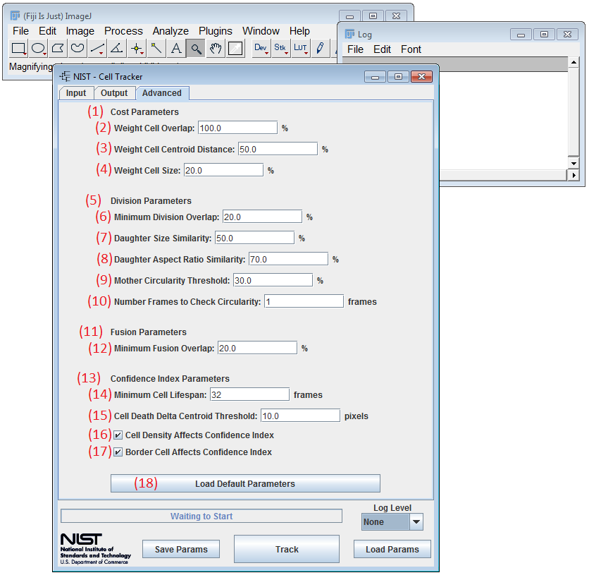

* **(1) Cost Parameters** - The cell tracker uses a cost function to create a tracking decision between cells in consecutive frames. The weights represent the importance of each term in the computation of the cost function. The higher the weight the more important is that term. The cost function that relates two Cellular objects between consecutive frames is computed using the following normalized weighted 3 time-lapse cell characteristics:

  1.  **(2) Weight Cell Overlap** - If cells tend to move slowly and have big overlapping areas between consecutive frames, then this value should be the highest among all other cost function weights.

  2.  **(3) Weight Cell Centroid Distance** - In the event when cells don’t overlap as much and/or amount of overlap is almost similar, the distance of their centroids movement will make the difference in the tracking decision.

  3.  **(4) Weight Cell Size** - If cells retain their size between consecutive frames then this weight value should be high. However, if cells go into mitosis and their respective size changes rapidly then this value should be low.

Some possible scenarios for cell tracking: *Problem 1* is our typical problem encountered in most cases, when cells change shape often and go into mitosis and image acquisition rate is high enough that there are good cellular overlaps between consecutive acquisitions. In general, the overlap weight should be proportional to the acquisition rate. *Problems 2* and *Problem 3* are considered to have low acquisition rates. In *Problem 2* cells change shape but don’t move long distances and in *Problem 3* like for particle tracking problems where objects don’t change shape and we have low image acquisition rate. A proposed weight combination to solve each of these problems is given in the table below. It is important to note that the cell tracker is very robust with regards to the weights. The three weights don’t need to be changed for solving similar problems like the ones displayed in the table below.

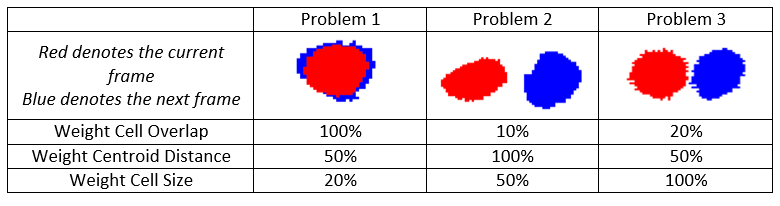

* **(5) Division Parameters** - The cell tracker bases its decision on detecting mitotic events using cell overlap between mother and its 2 daughter cells. If the cell overlap between one frame and the next is above the Min Division Overlap threshold, the Cell Tracker will label that as a possible mitosis event. The Cell Tracker will then test the Daughter Size Similarity, Daughter Aspect Ratio Similarity, and Mother Circularity Index thresholds to determine if a mitotic event has occurred. If all of the tests pass, the Cell Tracker will record the mitotic event in the division table.

  1.  **(6) Minimum Division Overlap** - If cell overlap in percent is above this threshold between one frame and the next the Cell Tracker will record a possible mitotic event. The following table illustrates the value of this parameter with respect to the overlapping positions between a red cell from the current frame and     the blue cell from the next frame. If this parameter is set to 0%, all cases will be considered as a potential mitotic event. If this parameter is set to 100% cell mitosis is discarded where the daughter cell that overlaps the most with the mother cell will keep its unique global ID label and the other one will get a new label.

      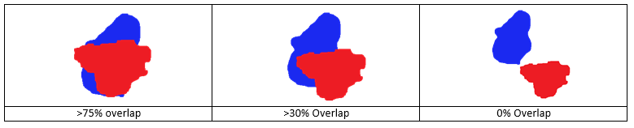

  2.  **(7) Daughter Size Similarity** - This parameter is a measure of the size similarity between daughter cells. In a real mitotic event the size of the daughter cells should be very similar to each other. A mother cell doesn’t really produce a large daughter and a small one. Set this parameter to 0% to discard it.

      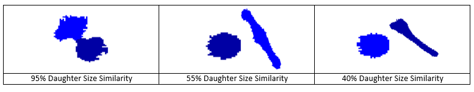

  3.  **(8) Daughter Aspect Ratio Similarity** - This parameter is a measure of the aspect ratio similarity between daughter cells. In a real mitotic event daughter cells should have similar shapes to each other. Set this parameter to 0% to discard it.

     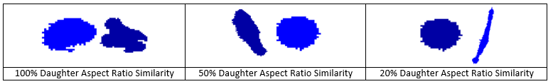

  4.  **(9) Mother Circularity Threshold** - For a cell to be considered a mother cell in a possible mitotic event it must have been round within the previous **Number of Frames to Check Circularity** parameter. This circularity threshold determines what is round enough to be considered a mitotic cell. Set this parameter to 0% to discard it.

      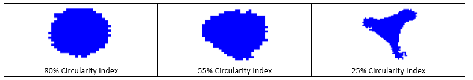

  5.  **(10) Number Frames to Check Circularity** - The Cell Tracker will determine if the cell had a circularity threshold above the Mother Circularity Index between the current frame and the previous number of frames. If the cell’s circularity is not above the threshold at least for one frame within this range, then the mitotic event will not be recorded.

* **(11) Fusion Parameters** - Cell fusion occurs when multiple cells get together and form one cellular object. It can come from an actual fusion where, for example, two colonies merge into one or from cells migrating so close together that segmentation technique considers them a single cell.

  1. **(12) Minimum Fusion Overlap** - This parameter represents the amount of overlap in percent of cell area, above which an area at the current frame is considered as a group of cells from the previous frame and that this area needs to be split into multiple single cells. For example: if 2 cells A & B at frame *t* have tracks to the same cell C at frame *t+1* and the amount of overlap between A&C = 45% of size A and the overlap between B&C = 50% of size B, then C should be split into 2 single cells.

* **(13) Confidence Index Parameters** - The Lineage Mapper assigns a tracking confidence index for each tracked object in the time-lapse sequence. The confidence index is only an indicator of how well we trust the track of a given cell during its entire cell cycle. There are three components that can affect the computation of the confidence index; each one can be disabled if needed: cell lifetime threshold, neighbor density, and border distance. All cells start with the same confidence index value of 1, and then we analyze the confidence index parameters of each cell. For example, if a cell meets the minimum expected lifetime defined by the user, the confidence increases by a point. The confidence index decreases if a cell was in a very confluent area and was touching other cells or if a cell was too close to the border (as defined by the user).

  1.  **(14) Minimum Cell Lifespan** - The minimum cell life is the number of frames a cell must be present throughout to increase its confidence by a point. This index does not affect cells that are present at the beginning of the experiment (first frame).

  2.  **(15) Cell Death Delta Centroids Threshold** - If a cell centroid does not move more than this value (in pixels) the cell will be recorded as dead.

  3.  **(16) Cell Density Affects Confidence Index** - If enabled, a lower confidence index will be assigned to cells that have grouped into colonies or become close to other cells.

  4.  **(17) Border Cell Affects Confidence Index** - If enabled, only cells that never touch the image border (Field of View) boundaries will increase their corresponding confidence index by a point.

* **(18) Load Default Parameters** - Loads the default tracking parameters into the GUI.

# FAQ

Coming soon
